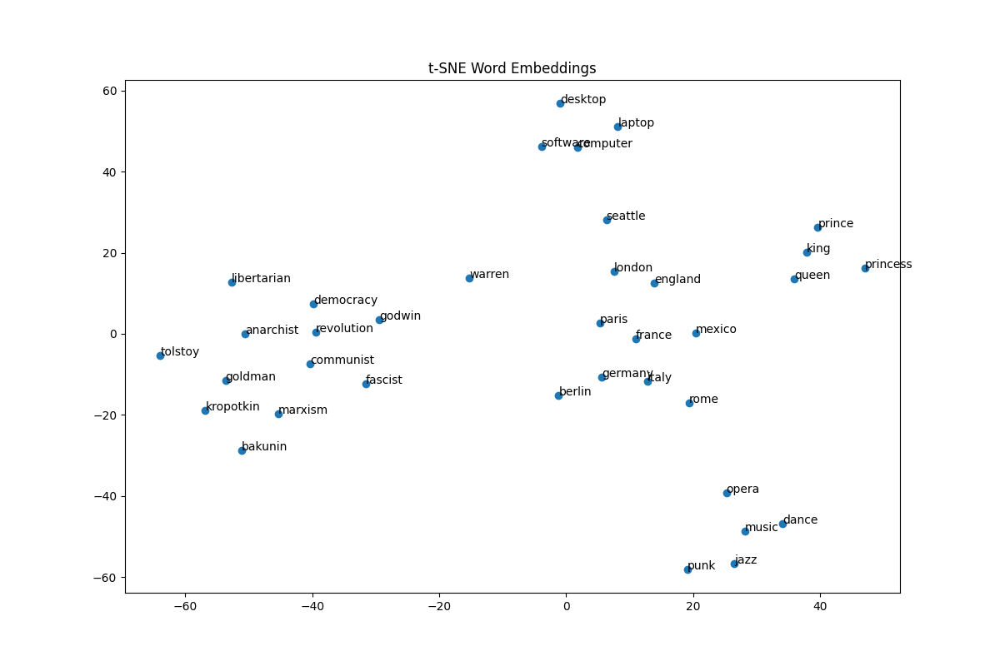
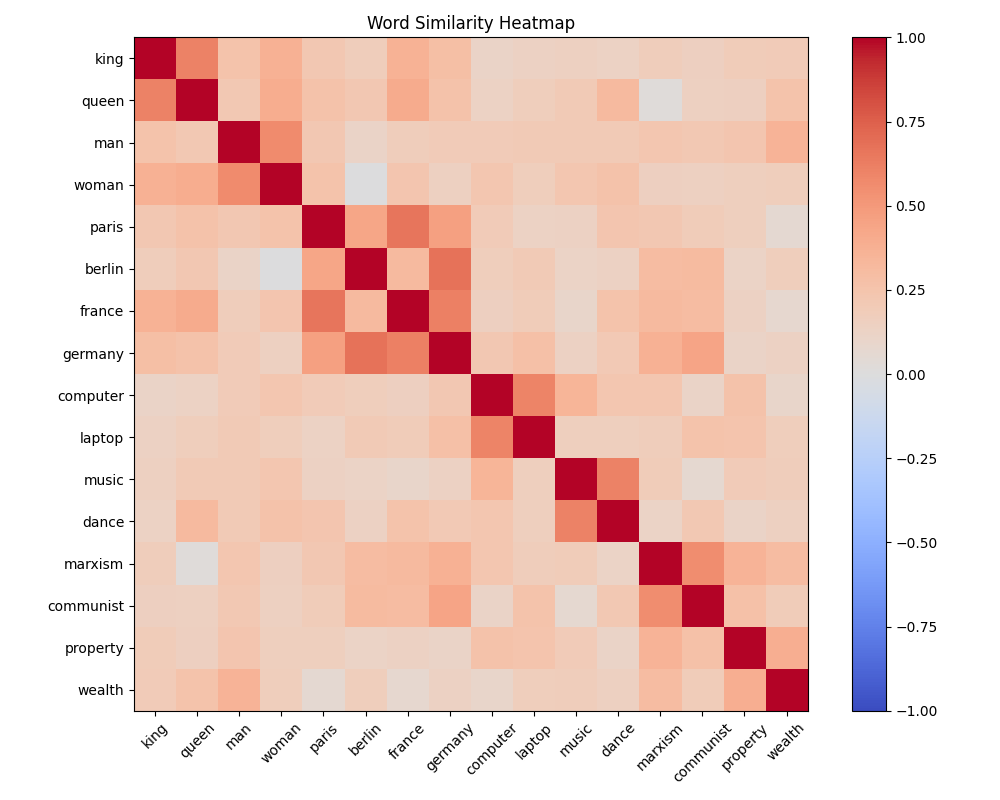
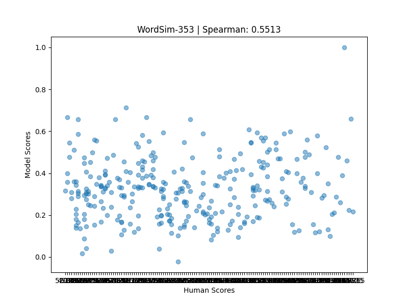

# Word2Vec — Skip-Gram with Negative Sampling

A from-scratch implementation of the Word2Vec skip-gram 
model with negative sampling (SGNS), built using pure NumPy 
— no deep learning frameworks.

---

## Overview

This project implements the core Word2Vec training pipeline,
following the original Mikolov et al. (2013) paper.
The model learns dense word representations (embeddings) 
purely from co-occurrence patterns in raw text, 
without any explicit semantic supervision.

The model was trained on the text8 dataset 
(~3M tokens, ~2M effective after preprocessing).

---

## Implementation Details

### Preprocessing
- Vocabulary filtering — words appearing fewer than 5 times are discarded
- Subsampling of frequent words using the formula:
  `p_discard = max(0, 1 - sqrt(t / f))`
  where `f` is word frequency and `t = 1e-3`

### Training
- Skip-gram architecture with negative sampling (SGNS)
- Window size: 5
- Embedding dimension: 100
- Negative samples per pair: 7
- Batch size: 512
- Epochs: 20
- Linear learning rate decay from 0.025 to ~0.0

### Negative Sampling
Negative samples are drawn according to the modified 
unigram distribution:
`P(w) ∝ f(w)^(3/4)`
as proposed in the original paper.

### Optimization
- Vectorized forward and backward pass over full batches
- `np.add.at` used for correct gradient accumulation 
  when duplicate indices appear in a batch
- Linear learning rate decay throughout training

---

## Data & Pretrained Embeddings

The model was trained on approximately 2 million tokens from the text8 dataset.
Training takes around 226 minutes on CPU — to skip training, 
pretrained embeddings and other large files are available on Google Drive:

| File | Description | Link |
|------|-------------|------|
| cache.pkl | Cached preprocessed dataset | [Download](https://drive.google.com/file/d/11hLmWJeXHG3zeCz-VZMtpU-aqMm3ABfd/view?usp=drive_link) |
| embeddings.pkl | Pretrained word embeddings | [Download](https://drive.google.com/file/d/1S2SJrVn8V2C4cHESRm8X4jOTjcwi-ALw/view?usp=drive_link) |
| text8 | Training dataset | [Download](https://drive.google.com/file/d/1C7gPS4mYXCNnKK3CpeM9-v00fgQ5pkJ-/view?usp=drive_link) |

Place all downloaded files in the `data/` folder before running any scripts.

---

## Setup & Usage

### Requirements

```bash
pip install -r requirements.txt

```

### Run Training (optional, it takes ~226 minutes)

```bash
python train.py

```

### Run Evaluation
```bash
python evaluate.py

```

### Run Visualizations
```bash
python visualizations.py

```
---

## Evaluation Results

### Most Similar Words
Nearest neighbours computed using cosine similarity.
Results demonstrate that the model captures semantic
and morphological relationships between words:

```
most_similar("computer")  → computers, computing, software, apple
most_similar("music")     → folk, musical, pop, jazz
most_similar("communist") → communism, communists, socialist, stalinist
most_similar("evolution") → evolutionary, creationists, biogeography, genetics
most_similar("terrorism") → killings, osama, laden, qaeda
most_similar("france")    → nantes, paris, spain, clermont

```

### Word Analogies
Analogy queries of the form: word_a - word_b + word_c = ?
```

paris - france + germany = ?
→ berlin (0.6745), munich (0.6263)


king - man + woman = ?
→ consort, melisende, infanta
  (queen not found, but semantically close royalty terms)

'anarchism' - 'anarchist' + 'communist' = ?
→ capitalism (0.5738), communism (0.5701)

```


### WordSim-353 Benchmark

| Metric | Score |
|--------|-------|
| Spearman Correlation | 0.5513 |
| p-value | ~0.0000 |
| Coverage | 324/353 pairs |

A p-value of ~0.0000 indicates that the correlation
is statistically significant.

---


## t-SNE Visualization of Word Embeddings

The t-SNE plot shows a 2D projection of the learned 
word embeddings. Semantically related words naturally cluster 
together, demonstrating that the model has captured meaningful 
relationships between words:

- **Royalty**: king, queen, prince, princess
- **European Geography**: france, paris, germany, berlin, italy, rome
- **Music**: music, jazz, opera, punk, dance
- **Technology**: computer, software, laptop, desktop
- **Anarchism/Politics**: anarchist, communist, marxist, 
                          kropotkin, bakunin, goldman

This clustering emerges purely from co-occurrence patterns 
in the training data, without any explicit semantic supervision.




## Word Similarity Heatmap

The heatmap displays cosine similarity scores between 
a selected set of words. Brighter red indicates higher 
similarity, while blue indicates opposing contexts.
Cosine similarity ranges from -1 to 1, where 1 indicates 
identical direction, 0 no relation, and negative values 
indicate opposing contexts.

Several meaningful patterns emerge:

- **Royalty**: king and queen show high mutual similarity,
  reflecting their shared royal context
- **Geography**: paris, berlin, france and germany form 
  a distinct high-similarity cluster, with cities and 
  their corresponding countries closely aligned
- **Technology**: computer and laptop are closely related,
  while being distant from unrelated concepts
- **Arts**: music and dance share similar contexts
- **Politics/Ideology**: marxism and communist are 
  strongly associated
- **Economics**: property and wealth appear in 
  similar contexts

These patterns emerge purely from co-occurrence 
statistics in the training data, without any explicit 
semantic supervision.




## WordSim-353 Evaluation

The scatter plot shows the correlation between human 
similarity judgements (x-axis) and model's cosine 
similarity scores (y-axis) on the WordSim-353 benchmark.

Each point represents a word pair. A perfect model would 
show a clear diagonal trend — pairs that humans rate as 
highly similar would also receive high cosine similarity 
scores from the model.



**Spearman correlation: 0.5513**

The model achieves a moderate-to-good correlation with 
human judgements, trained on only 2 million tokens of 
the text8 dataset using pure NumPy. The visible scatter 
reflects the limited training data size — results are 
expected to improve significantly with more training data.


